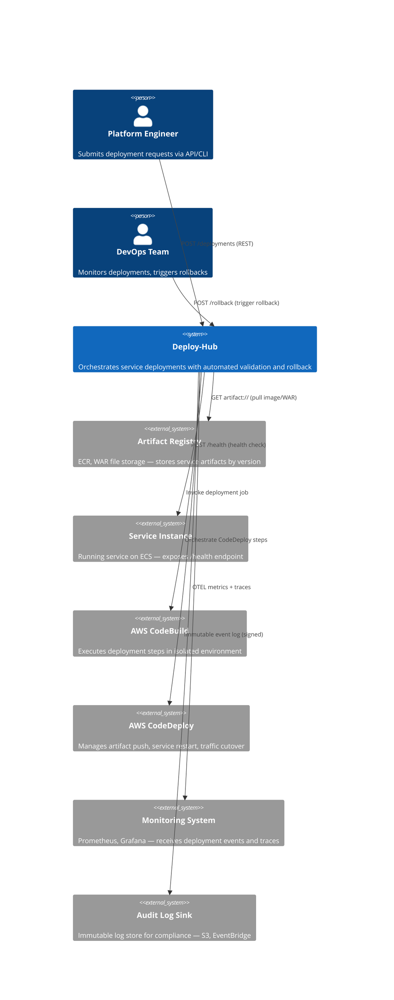
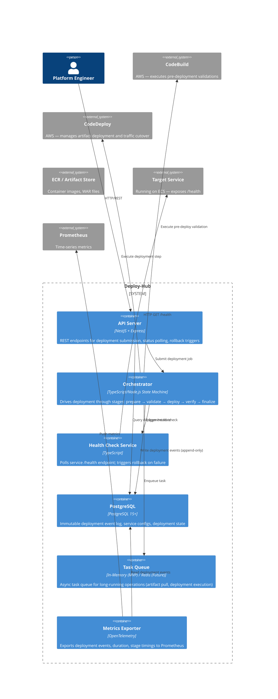
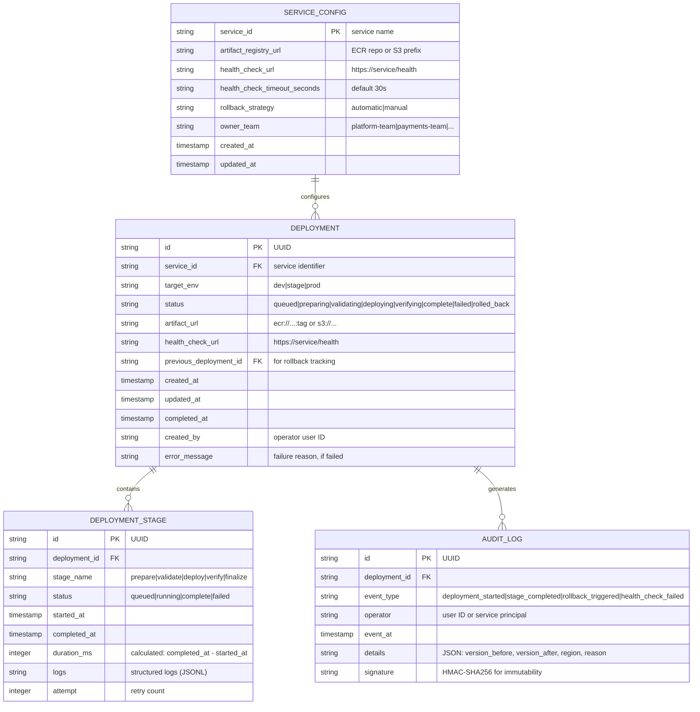

# Deploy-Hub Architecture

**Date:** 2026-05-21  
**Stage:** 2 — Design  
**Status:** Proposed  

---

## Table of Contents

1. [System Context](#system-context)
2. [Container Architecture](#container-architecture)
3. [Deployment Model](#deployment-model)
4. [Data Model](#data-model)
5. [State Machine](#state-machine)
6. [Security Model](#security-model)
7. [Scalability & Performance](#scalability--performance)
8. [Critical User Journeys](#critical-user-journeys)

---

## System Context

### C4 Context Diagram



**Boundary:** Deploy-hub abstracts platform engineers from AWS service details (CodePipeline, CodeBuild, CodeDeploy). External systems are owned by separate teams:
- **Artifact Registry:** infra-core
- **Service Infrastructure (ECS, networking):** infra-service
- **Monitoring & Alerting:** observability platform
- **Audit Storage:** compliance/security team

---

## Container Architecture

### C4 Container Diagram



### Container Responsibilities

| Container | Technology | Responsibility |
|---|---|---|
| **API Server** | NestJS 10+ | Accept REST requests, validate input, return status, auth enforcement, rate limiting |
| **Orchestrator** | TypeScript + State Machine library | Drive deployment state transitions, handle failures, trigger rollbacks, coordinate stages |
| **Health Check Service** | TypeScript | Async health polling; triggers orchestrator callback on pass/fail |
| **PostgreSQL** | PostgreSQL 15+ | Immutable append-only log of all deployment events; queryable state for status polls |
| **Task Queue** | In-Memory (MVP) / Redis (future) | Decouple long-running ops from API response path |
| **Metrics Exporter** | OpenTelemetry SDK | Collect deployment duration, stage timing, success rate; push to Prometheus |

---

## Deployment Model

### Runtime Environment

**Target:** AWS ECS on EC2 (per platform standard — see ADR-001)

```
┌────────────────────────────────────────┐
│         AWS VPC (prod-deploy-hub)      │
├────────────────────────────────────────┤
│  ALB (prod-deploy-hub-alb)             │
│  - Listener: :443 → HTTPS              │
│  - Health check: /health every 30s    │
│  - Target group: port 3000             │
├────────────────────────────────────────┤
│  ECS Cluster (prod-deploy-hub-cluster) │
│  ┌──────────────────────────────────┐  │
│  │ ECS Task (prod-deploy-hub-api)   │  │
│  │ - Container: deploy-hub:sha      │  │
│  │ - CPU: 1 vCPU                    │  │
│  │ - Memory: 1 GB                   │  │
│  │ - Port: 3000                     │  │
│  │ - Env: POSTGRES_URL, NODE_ENV   │  │
│  └──────────────────────────────────┘  │
│  ┌──────────────────────────────────┐  │
│  │ ECS Task (prod-deploy-hub-api-2) │  │
│  │ - Container: deploy-hub:sha      │  │
│  │ - CPU: 1 vCPU                    │  │
│  │ - Memory: 1 GB                   │  │
│  │ - Port: 3000                     │  │
│  │ - Env: POSTGRES_URL, NODE_ENV   │  │
│  └──────────────────────────────────┘  │
│  Auto-scaling: min=2, max=5 tasks     │
│  (target: 70% CPU utilization)        │
├────────────────────────────────────────┤
│  RDS PostgreSQL (prod-deploy-hub-db)   │
│  - db.t3.small (MVP → db.t3.medium)   │
│  - Multi-AZ failover enabled          │
│  - Automated backup: 30 days          │
│  - Storage: 100 GB (gp3), auto-scale │
└────────────────────────────────────────┘
```

### Naming Convention

Per platform standard (NASCO copilot-instructions.md §11):

```
<env>-<service>-<component>[-<qualifier>]
```

Examples:
- `prod-deploy-hub-alb` (ALB)
- `prod-deploy-hub-cluster` (ECS Cluster)
- `prod-deploy-hub-api` (ECS Task Definition)
- `prod-deploy-hub-db` (RDS Instance)
- `prod-deploy-hub-db-subnet-group` (RDS Subnet Group)

### High Availability & Scaling

- **API Tier:** 2–5 ECS tasks across multiple availability zones (AZ), ALB health checks every 30 seconds
- **Database:** PostgreSQL Multi-AZ with automated failover
- **Circuit breaker:** External service calls (CodeBuild, CodeDeploy, artifact registry) implement exponential backoff + timeout
- **Graceful shutdown:** SIGTERM handling to drain in-flight deployments (30-second window)

---

## Data Model

### Entity-Relationship Diagram



### Schema Notes

- **Deployment.status:** Finite state machine with allowed transitions (see State Machine section)
- **Deployment_Stage.logs:** Stored as newline-delimited JSON (JSONL) for efficient streaming
- **Audit_Log.signature:** HMAC computed over `deployment_id + event_type + event_at + details`; allows offline verification
- **Service_Config:** Cached in API server memory with TTL of 5 minutes; misses trigger database read

---

## State Machine

### Deployment State Transitions

```
                 ┌─────────────────────────────────────┐
                 │                                     │
                 ▼                                     │
    ┌──────────────────────┐                          │
    │ QUEUED               │  <── Initial state        │
    │ (Validating input)   │                          │
    └──────────────────────┘                          │
           │                                          │
           ▼ (input valid)                            │
    ┌──────────────────────┐                          │
    │ PREPARING            │  <── Fetch artifact      │
    │ (Pull artifact,      │      Pre-deploy checks   │
    │  pre-deploy checks)  │                          │
    └──────────────────────┘                          │
           │                                          │
           ├─ (checks fail) ──> FAILED               │
           │                                          │
           ▼ (checks pass)                            │
    ┌──────────────────────┐                          │
    │ VALIDATING           │  <── Deploy to ECS       │
    │ (CodeDeploy step)    │                          │
    └──────────────────────┘                          │
           │                                          │
           ├─ (deploy fails) ──> FAILED              │
           │                                          │
           ▼ (deploy succeeds)                        │
    ┌──────────────────────┐                          │
    │ VERIFYING            │  <── Health checks       │
    │ (Health check 2 min) │      2 attempts, 30s     │
    │                      │      timeout each        │
    └──────────────────────┘                          │
           │                                          │
           ├─ (health fail) ──> ROLLING_BACK         │
           │                    (auto-triggered)      │
           │                                          │
           ▼ (health pass)                            │
    ┌──────────────────────┐                          │
    │ COMPLETE             │  <── Mark as success     │
    │ (Deployment done)    │      Log final state     │
    └──────────────────────┘                          │
                                                      │
    ┌──────────────────────┐                          │
    │ ROLLING_BACK         │ <─────────────────────┘
    │ (Manual or auto)     │
    └──────────────────────┘
           │
           ├─ (rollback succeeds) ──> ROLLED_BACK
           │
           ├─ (rollback fails) ──> FAILED
           │
           └─ (manual stop) ──> FAILED
```

### Terminal States

- **COMPLETE:** Deployment succeeded; health checks passed
- **FAILED:** Deployment did not complete; manual recovery may be needed
- **ROLLED_BACK:** Previous version restored successfully

### Auto-Rollback Trigger

- Health check failure in VERIFYING stage triggers orchestrator to:
  1. Transition to ROLLING_BACK
  2. Invoke CodeDeploy with previous deployment artifact
  3. Wait for new health checks (2 min)
  4. If healthy → ROLLED_BACK; if unhealthy → FAILED

---

## Security Model

### Authentication & Authorization

| Component | Mechanism | Notes |
|---|---|---|
| **API Endpoints** | Bearer token (OpenID Connect, AWS IAM, or custom JWT) | Upstream RBAC system enforces "can deploy to prod?" |
| **Audit Trail** | Read-only to security/compliance role | All queries logged; suspicious access triggers alert |
| **Artifact Registry** | IAM role on ECS task | Task assumes role with `ecr:GetDownloadUrlForLayer`, `ecr:BatchGetImage` |
| **CodeBuild/CodeDeploy** | IAM role on ECS task | Assume role with `codebuild:BatchGetBuilds`, `codedeploy:StopDeployment`, etc. |

### Data Protection

| Data | Protection | Justification |
|---|---|---|
| **Deployment state** | At-rest encryption (RDS encryption enabled) | Compliance: may contain deployment args with secrets |
| **Audit logs** | HMAC-SHA256 signature on each row | Immutability proof for compliance audits |
| **Logs/output** | Filtered of secrets via structured logging | No password, API key, or token in logs |
| **Mutable artifacts** | Immutable by design (content-addressed by SHA) | Rolling back requires artifact to be available forever or re-created from source |

### API Security

- **Rate Limiting:** 100 requests/minute per service (platform standard from SPEC.md)
- **TLS:** All inter-container communication via mTLS (future: Istio/service mesh)
- **Secrets:** Database password, artifact registry credentials passed via environment variables or AWS Secrets Manager
- **CORS:** Disabled for API-only service; cross-origin calls via API Gateway (if needed)

---

## Scalability & Performance

### Design Targets

From SPEC.md:

| Metric | Target | Design |
|---|---|---|
| **Deployment end-to-end time** | < 45 min (single-region MVP) | Artifact pull (5 min) + deploy (20 min) + health checks (2 min) + overhead (15 min) |
| **API response latency** | < 500 ms | Cached service configs; async orchestration off critical path |
| **Status poll latency** | < 100 ms | Direct database read from cache or query plan |
| **Concurrent deployments** | ≥ 50 | In-memory queue (MVP); async processing with task pool |
| **RPS per service** | 100 req/min | Single API instance can handle 10+ services at full rate |

### Capacity Planning

**Initial (MVP):**
- 1 ECS task (1 vCPU, 1 GB RAM) handles 20–30 concurrent deployments
- PostgreSQL db.t3.small: 100 GB storage, IOPS 3000 (gp3)

**Growth (3 months):**
- Scale to 3 ECS tasks (auto-scaling group 2–5)
- PostgreSQL db.t3.medium: 200 GB storage, IOPS 5000 (gp3)

**Database Query Performance:**

```sql
-- Most common query: deployment status
SELECT id, status, stage, progress FROM deployments 
WHERE id = $1 AND created_at > NOW() - INTERVAL '7 days';
-- Index: (id, created_at DESC)
-- Expected: <10 ms

-- Audit query: compliance request
SELECT * FROM audit_logs 
WHERE deployment_id = $1 AND event_at BETWEEN $2 AND $3;
-- Index: (deployment_id, event_at DESC)
-- Expected: <50 ms
```

### Connection Pooling

- **PgBouncer (MVP):** 20 connections, transaction mode
- **Future:** Use NestJS TypeORM connection pooling (default 10 connections)

---

## Critical User Journeys

### CRITICAL-JOURNEY-1: Deploy Service Version (Blue-Green)

```
Actor: Platform Engineer
Goal: Deploy new service version with automated validation and traffic cutover

1. Engineer submits deployment request:
   POST /deployments {
     service_id: "payments-api",
     target_env: "prod",
     artifact_url: "ecr://payments-api:v2.4.1-prod",
     health_check_url: "https://payments-prod.nasco.com/health"
   }

2. API validates request (30s):
   - service_id exists in ServiceConfig
   - artifact_url is reachable
   - health_check_url is reachable

3. Orchestrator prepares (5 min):
   - Pull artifact from ECR
   - Run pre-deploy validation (code scan, schema validation)

4. Orchestrator deploys (20 min):
   - Invoke CodeDeploy with new artifact
   - CodeDeploy rolls out to ECS tasks
   - CodeDeploy updates ALB target group

5. Orchestrator verifies (2 min):
   - Poll /health endpoint (2 attempts, 30s each)
   - If healthy → transition to COMPLETE

6. Engineer polls GET /deployments/{id}:
   - Returns status: "complete", stage: "verify", progress: 100%

7. Deployment audit logged:
   - event: "deployment_complete"
   - operator: "engineer@nasco.com"
   - artifact_before: "v2.4.0-prod"
   - artifact_after: "v2.4.1-prod"
   - duration: "27 minutes"

Result: ✅ New version live; previous version retained for rollback
```

### CRITICAL-JOURNEY-2: Multi-Region Deployment (Future, Not MVP)

```
Actor: Platform Engineer
Goal: Deploy service to multiple regions sequentially with canary validation

Flow (documented for future implementation):
1. Submit deployment with regions: ["us-east-1", "eu-west-1", "ap-southeast-1"]
2. Orchestrator deploys to us-east-1 first (canary, 10% traffic for 15 min)
3. If canary healthy, proceed to eu-west-1
4. If canary fails, stop and rollback us-east-1 only
5. Repeat for ap-southeast-1
6. Multi-region deployment marked COMPLETE only after all regions healthy

Note: MVP does not support multi-region; single-region deployment only.
```

### CRITICAL-JOURNEY-3: Automated Rollback on Health Check Failure

```
Actor: Automatic (triggered by health check failure)
Goal: Restore previous stable version without manual intervention

1. Deployment reaches VERIFYING stage
2. Health check fails (no response from /health endpoint)
3. Orchestrator immediately transitions to ROLLING_BACK
4. CodeDeploy re-deploys previous artifact (deployment.previous_deployment_id)
5. New health checks run (2 min)
6. If healthy → ROLLED_BACK; if not → FAILED (escalate to manual)

Timeline: ~10 minutes from failure detection to stable version restored
Result: ✅ Service restored to known-good state; incident logged with failure reason
```

### CRITICAL-JOURNEY-4: Real-Time Status Visibility & Audit Trail

```
Actor: DevOps Engineer / Compliance Team
Goal: Monitor deployment progress and retrieve immutable audit trail

DevOps monitoring flow:
1. Engineer polls GET /deployments/{id}?include=stages
   Response: { status, stages: [{stage_name, status, duration_ms, logs}], ...}

2. Alert system receives OTEL metrics:
   deploy_hub.deployment.duration_ms (histogram)
   deploy_hub.deployment.status (counter: success/failure)

3. Compliance query:
   GET /audit?deployment_id={id}&date_range={start,end}&format=csv
   Response: Immutable CSV of all events with signatures

Result: ✅ Real-time visibility; audit trail is compliance-ready
```

---

## Threat Model (STRIDE)

### Trust Boundaries

1. **Boundary 1: Engineer → API Server**
   - **Threat:** Unauthorized deployment submission (AUTHENTICATION)
   - **Mitigation:** Require Bearer token; upstream RBAC enforces permission checks

2. **Boundary 2: API Server → AWS Services (CodeBuild/CodeDeploy)**
   - **Threat:** Credential leakage via logs or error messages (INFORMATION DISCLOSURE)
   - **Mitigation:** Use IAM role (not explicit credentials); structured logging filters secrets

3. **Boundary 3: API Server → PostgreSQL**
   - **Threat:** SQL injection via artifact_url or other user inputs (TAMPERING)
   - **Mitigation:** Parameterized queries; input validation on API layer

4. **Boundary 4: Orchestrator → Target Service**
   - **Threat:** MITM attack on health check polling (TAMPERING)
   - **Mitigation:** HTTPS + certificate validation; future mTLS via service mesh

### OWASP Top 10:2025 Applicability

| Category | Risk | Mitigation |
|---|---|---|
| **A01:2025 Broken Access Control** | Unauthorized deployments to prod | RBAC via upstream; deploy-hub enforces token validation |
| **A02:2025 Cryptographic Failures** | Credentials in logs or transit | Structured logging filters; mTLS for inter-service (future) |
| **A03:2025 Injection** | SQL injection via artifact_url | Parameterized queries; input schema validation (OpenAPI) |
| **A04:2025 Insecure Design** | No rate limiting | 100 req/min per service (hardcoded in API) |
| **A05:2025 Security Misconfiguration** | RDS encryption disabled | Enabled by default in Terraform IaC |
| **A06:2025 Vulnerable/Outdated Components** | NestJS, Node.js security patches | Dependabot scans; CVE tracking in SLA |
| **A07:2025 Auth/Session Management** | Token expiration, revocation | Delegated to upstream OIDC provider |
| **A08:2025 Data Integrity Failures** | Audit log tampering | HMAC signature on each audit row |
| **A09:2025 Logging/Monitoring** | Insufficient breach detection | Audit logs to immutable sink; CloudWatch monitoring |
| **A10:2025 SSRF** | CodeBuild invocation to internal service | Restrict CodeBuild VPC access via IAM policy |

---

## Open Questions & Future Work

1. **Feature Flags:** How will incomplete features (e.g., multi-region) ship safely? (Answer: behind feature flags in API layer; future design doc)
2. **State Recovery:** If orchestrator crashes mid-deployment, how is state recovered? (Answer: idempotent operations; deploy-hub reads current state from CodeDeploy API)
3. **Approval Gates:** Are deployment approval workflows handled by deploy-hub or upstream? (Answer: upstream RBAC; deploy-hub does not implement approval logic — per SPEC.md out-of-scope)
4. **Metrics Retention:** How long are deployment event metrics retained? (Answer: PostgreSQL retention 90 days — per SPEC.md compliance requirement)
5. **Multi-Cloud Support:** Is AWS-only acceptable for MVP? (Answer: Yes, per SPEC.md assumptions; multi-cloud is future work)

---

## References

- **SPEC.md:** Business requirements, critical user journeys, constraints
- **ROADMAP.md:** Timeline, dependencies, MVP scope
- **ADR-001:** CI/CD Stack Deviation (CodePipeline vs. GitHub Actions)
- **ADR-002:** Database Choice (single PostgreSQL)
- **API-CONTRACTS.yaml:** OpenAPI 3.0 REST interface specification
